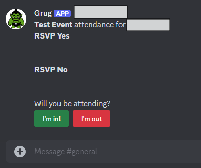
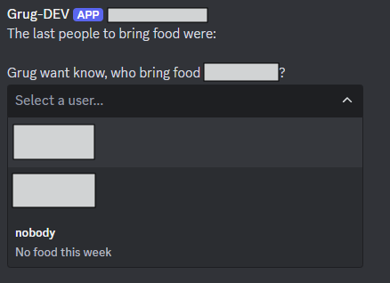
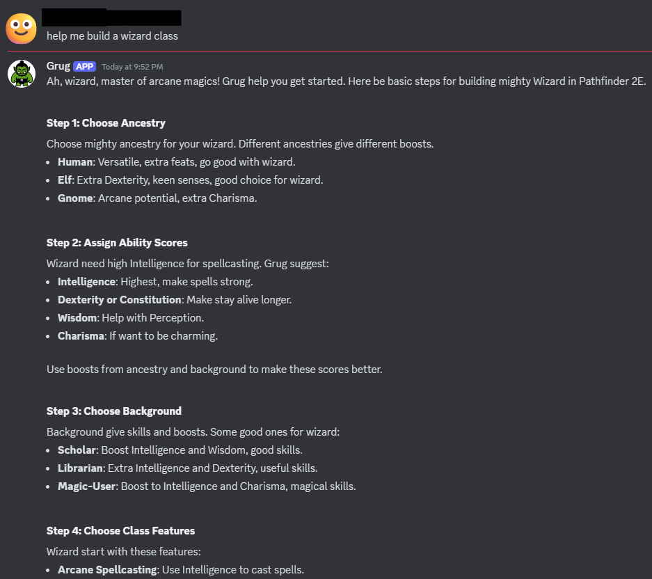
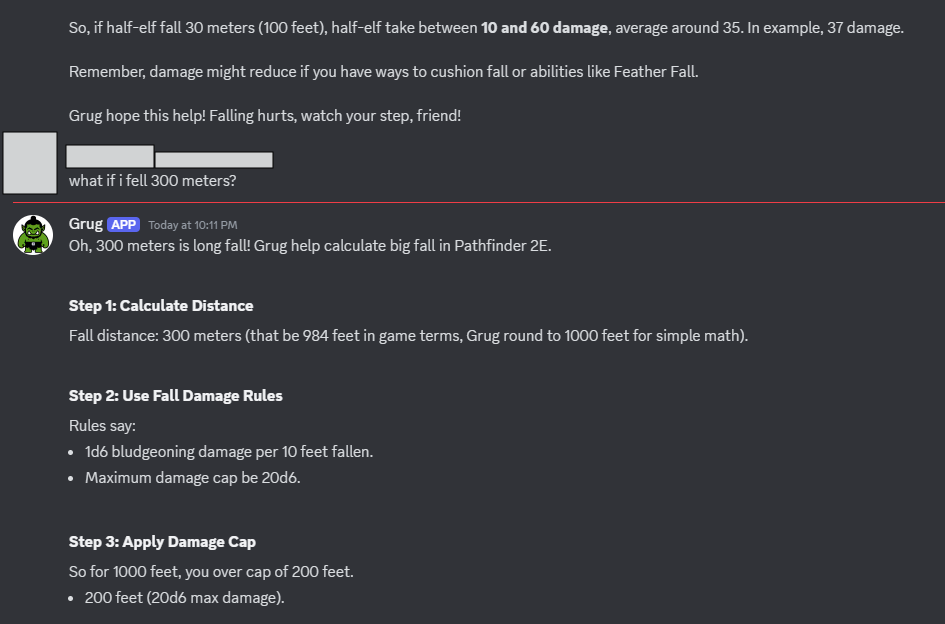

# Usage - Grug

This document outlines the various features and capabilities of Grug, a Discord bot designed to assist groups of people
who play tabletop RPGs. By using Grug, you agree to abide by the [Terms of Service](terms_of_service.md). Please read
them carefully.

## Attendance Tracking

Grug provides a simple and intuitive way to track attendance for your tabletop RPG group. You can create events, add
players, and mark their attendance with a single command.

## Food Reminders

Grug can help you keep track of who's on for food at your next game session. You can assign players to bring food, and
Grug will remind them when the time comes.

## Answering Questions

Grug can answer questions from your group members. You can ask Grug anything, and it will do its best to provide a
helpful response.

Here is an example of Grug helping to create a character:

Here is an example of Grug helping to answer a question about fall damage:

