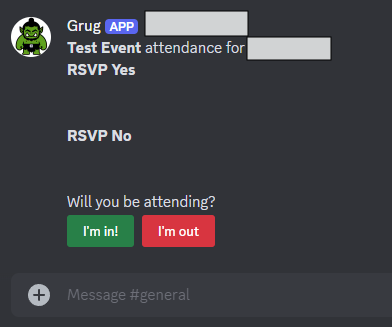

  

# Grug Bot

**Documentation**:
<a href="https://foehammer82.github.io/Grug" target="_blank">https://foehammer82.github.io/Grug</a>

**Source Code**:
<a href="https://github.com/Foehammer82/Grug" target="_blank">https://github.com/Foehammer82/Grug</a>

The Grug app is a Discord bot designed to assist groups of people who play tabletop RPGs, such as Dungeons and Dragons
(DnD) or Pathfinder. It offers a variety of features aimed at enhancing the gaming experience and managing group
activities. The project was initiated to streamline the management of attendance and food schedules for tabletop RPG
groups, but has since expanded to include capabilities like image generation and answering questions.

## Key Features

### Attendance Tracking

Grug provides a simple and intuitive way to track attendance for your tabletop RPG group. You can create events, add
players, and have Grug send attendance reminders.

### Food Scheduling

Grug can help you schedule food for your group. You can create food events, add players, and have Grug send food
reminders.

### Image Generation

Grug can generate images for your group. Just ask Grug to generate an image and he will create one for you.

!!! note

    All images are generated using the OpenAI API Dall-E.

### Question Answering

Grug can answer questions for your group. Just ask Grug a question and he will do his best to answer it.

!!! note

    All responses are generated using the OpenAI API.

